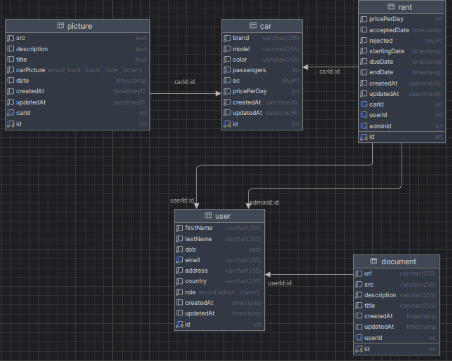

=  Car Rental

==  Ejecución del proyecto de manera local

===== 1. Iniciar el servicio de LocalStack con S3

Para correr LocalStack en un contenedor Docker en el puerto 4566, ve al proyecto nestjs y en el directorio raiz ejecuta:

	~docker run --rm -it -p 4566:4566 localstack/localstack

Mientras el docker esta levantado ejecuta el siguiente comando para crear el bucket en LocalStack:

	~awslocal s3 mb s3://mi-bucket-local

===== 2. Verificar que S3 está funcionando
Para listar los buckets y confirmar que se creó correctamente, usa:

	~awslocal s3 ls

===== 3. Iniciar el backend (NestJS)
Ve al directorio raiz del proyecto Nestjs y ejecuta:
	~npm run start:dev

===== 4. Iniciar el frontend
Ve al directorio raiz del proyecto React y ejecuta:
	~npm run dev

==  Uso de la aplicación
Abre un navegador y ve a:
👉 http://localhost:5173/

===  Credenciales de acceso

==== Admin
 Email: admin@rentalcars.com
 Password: 1234

==== Cliente
 Email: john.doe@example.com
 Password: 1234

== Requerimientos : 

=== 1-Usuario : 
* Como usuario, quiero poder subir mis documentos a la aplicación para que los administradores puedan verificar mi identidad.  
	- {POST {{baseUrl}}/document/upload} 
	- {GET {{baseUrl}}/document} 
* Como Usuario, quiero poder registrarme, recuperar mi contraseña y cerrar sesión en mi cuenta.  
		- Sign Up → POST {{baseUrl}}/auth/signup
		- Login → POST {{baseUrl}}/auth/login
		- Logout  → {{baseUrl}}/auth/logout}

=== 2- Cliente: Como cliente, quiero una cuenta de usuario para poder solicitar alquileres.  
* Como cliente , quiero ver un catálogo de los autos disponibles para poder elegir uno para alquilar. 
	- { GET{{baseUrl}}/cars }
* Como cliente, quiero ver los detalles de un auto en particular para poder alquilarlo.  
	- {GET {{baseUrl}}/cars/detail/:id}
* Como cliente, quiero poder solicitar el alquiler de un auto por un período de tiempo.  
	- {POST {baseUrl}}/rent/create}
* Como cliente, quiero ver el historial de mis solicitudes de alquiler.  
	- {GET {{baseUrl}}/rent/my-requests}
* Como cliente e, quiero actualizar mis datos de usuario para modificar mi descripción, nombre, edad, etc. 	
	- {GET {{baseUrl}}/user/information 
	- PATCH {{baseUrl}}/user/update}

=== 3- Administrador :
* Como administrador, quiero agregar nuevos autos, establecer su precio y cargar imágenes para incluirlos en la galería de autos. 
	- {POST {{baseUrl}}/cars/create 
	- {POST {baseUrl}}/picture/upload-for-car/:idCar} }
* Como administrador, quiero ver todos los autos. 
	- {GET{baseUrl}}/cars}
* Como administrador, quiero poder editar los detalles de un auto. 
	- {PATCH {baseUrl}}/cars/update/:idCar} 
	- GET{baseurl}/car/:id}
* Como administrador, quiero gestionar las imágenes relacionadas con un auto.
	- {GET {{baseUrl}}/picture/car/:idCar} 
	- {DELETE {baseUrl}}/picture/:id}
* Como administrador, quiero ver una lista de alquileres solicitados para poder ordenarlos por prioridad.  
	- {GET {baseUrl}}/rent/pending-requests}  
* Como administrador, quiero poder aprobar o rechazar un alquiler según los documentos proporcionados. 
	- {PATCH {baseUrl}}/rent/accept/:idRenta} 
	- {PATCH {baseUrl}}/rent/reject/:idRenta}
* Como administrador, quiero ver el historial de solicitudes de los usuarios para poder hacer una evaluación precisa del usuario.
	- {GET{baseUrl}/user/client} 
	- {GET{{baseUrl}}/rent/client/:idClient} 

===== Desarrollador: 
- Como desarrollador, necesito configurar el módulo de usuarios para los clientes.  
- Como desarrollador, necesito configurar el módulo de autos para clientes y administradores.  
- Como desarrollador, necesito configurar el módulo de alquileres para clientes y administradores.  
- Como desarrollador, necesito configurar el módulo de imágenes para los autos. 
 
- Como desarrollador, necesito configurar los roles de usuario (administrador y usuario) para proporcionar dos interfaces separadas.
- Como desarrollador, quiero que los usuarios no administradores sean redirigidos de las páginas de administración para poder trabajar de manera segura en mi aplicación.  
- Como desarrollador, quiero conectar mi billetera a la aplicación utilizando el Stellar SDK. 
- Como desarrollador, quiero configurar un bucket S3 para que los usuarios puedan subir archivos a mi aplicación.  

== Permisos por rol 
===== ADMIN :
- GET {{baseUrl}}/user/client
- GET {{baseUrl}}/rent/client/:idClient
- GET {{baseUrl}}/rent/pending-requests
- PATCH {{baseUrl}}/rent/accept/:idRent
- PATCH {{baseUrl}}/rent/reject/:idRent
- POST {{baseUrl}}/cars/create
- GET  {{baseurl}/car/:id}
- PATCH {{baseUrl}}/cars/update/:idCar
- POST {{baseUrl}}/picture/upload-for-car/:idCar
- GET {{baseUrl}}/picture/car/:idCar
- DELETE {baseUrl}}/picture/:idPicture

==== CLIENTE :
- POST {{baseUrl}}/rent/create
- GET {{baseUrl}}/rent/my-requests
- GET {{baseUrl}}/cars/detail/:idCar

==== USUARIO (CLIENTE Y ADMIN) : 
- POST {baseUrl}}/auth/login
- POST {{baseUrl}}/auth/signup
- GET {{baseUrl}}/user/information
- PATCH {{baseUrl}}/user/update
- POST{{baseUrl}}/document/create
- GET {{baseUrl}}/cars

=== DER

== Tecnologias

=== Back:

	* NestJs 
	* typorm
	* S3

=== Front:
	* React
	* Tailwindcss

=== Test : 
	* tjest 
